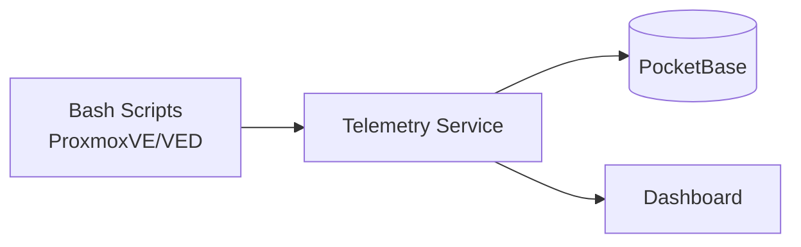

# Telemetry Service

A standalone Go microservice that collects anonymous telemetry data from [ProxmoxVE](https://github.com/community-scripts/ProxmoxVE) and [ProxmoxVED](https://github.com/community-scripts/ProxmoxVED) script installations.

## Overview

This service acts as a telemetry ingestion layer between the bash installation scripts and a PocketBase backend. When users run scripts from the ProxmoxVE/ProxmoxVED repositories, optional anonymous usage data is sent here for aggregation and analysis.

**What gets collected:**
- Script name and installation status (success/failed)
- Container/VM type and resource allocation (CPU, RAM, disk)
- OS type and version
- Proxmox VE version
- Anonymous session ID (randomly generated UUID)

**What is NOT collected:**
- IP addresses (not logged, not stored)
- Hostnames or domain names
- User credentials or personal information
- Hardware identifiers (MAC addresses, serial numbers)
- Network configuration or internal IPs
- Any data that could identify a person or system

**What this enables:**
- Understanding which scripts are most popular
- Identifying scripts with high failure rates
- Tracking resource allocation trends
- Improving script quality based on real-world data

## Features

- **Telemetry Ingestion** - Receives and validates telemetry data from bash scripts
- **PocketBase Integration** - Stores data in PocketBase collections
- **Rate Limiting** - Configurable per-IP rate limiting to prevent abuse
- **Caching** - In-memory or Redis-backed caching support
- **Email Alerts** - SMTP-based alerts when failure rates exceed thresholds
- **Dashboard** - Built-in HTML dashboard for telemetry visualization

## Architecture



## Dashboard

The built-in dashboard (`/dashboard`) provides real-time analytics:

- **Installation Statistics** - Total installs, success/failure rates
- **Top Applications** - Most installed scripts with counts
- **Failure Analysis** - Scripts with highest failure rates (min. 10 installs)
- **Resource Trends** - CPU, RAM, disk allocation over time
- **OS Distribution** - Popular operating systems
- **Proxmox Versions** - PVE version distribution

**Dashboard Features:**
- Automatic cache warmup (every 4 minutes)
- Configurable time range (7, 30, 90, 365 days)
- Shows actual total count vs. analyzed sample size
- Loading indicator during data fetch

## Project Structure

```
service.go      # Main service, HTTP handlers, rate limiting
cache.go        # In-memory and Redis caching
alerts.go       # SMTP alert system
dashboard.go    # Dashboard HTML generation
Dockerfile      # Container build
entrypoint.sh   # Container entrypoint
go.mod          # Go module definition
```

## Related Projects

- [ProxmoxVE](https://github.com/community-scripts/ProxmoxVE) - Proxmox VE Helper Scripts
- [ProxmoxVED](https://github.com/community-scripts/ProxmoxVED) - Proxmox VE Helper Scripts (Dev)

## API Endpoints

| Endpoint | Method | Description |
|----------|--------|-------------|
| `/` | POST | Receive telemetry data from scripts |
| `/health` | GET | Health check endpoint |
| `/dashboard` | GET | HTML dashboard UI |
| `/api/dashboard` | GET | Dashboard data as JSON |

## Privacy & Compliance

This service is designed with privacy in mind and is **GDPR/DSGVO compliant**:

- ✅ **No personal data** - Only anonymous technical metrics are collected
- ✅ **No IP logging** - Request logging is disabled by default, IPs are never stored
- ✅ **Transparent** - All collected fields are documented and the code is open source
- ✅ **No tracking** - Session IDs are randomly generated and cannot be linked to users
- ✅ **No third parties** - Data is only stored in our self-hosted PocketBase instance

For full details, see:
- **[Privacy & Telemetry Documentation](docs/PRIVACY.md)** — What we collect, how, and why
- **[Records of Processing Activities (ROPA)](docs/ROPA.md)** — GDPR Art. 30
- **[Technical & Organizational Measures (TOMS)](docs/TOMS.md)** — GDPR Art. 32

## License

MIT License - see [LICENSE](LICENSE) file.
